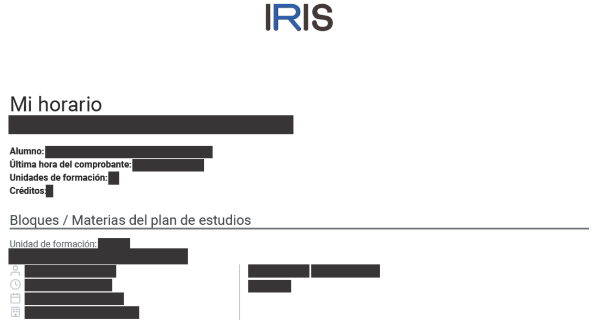
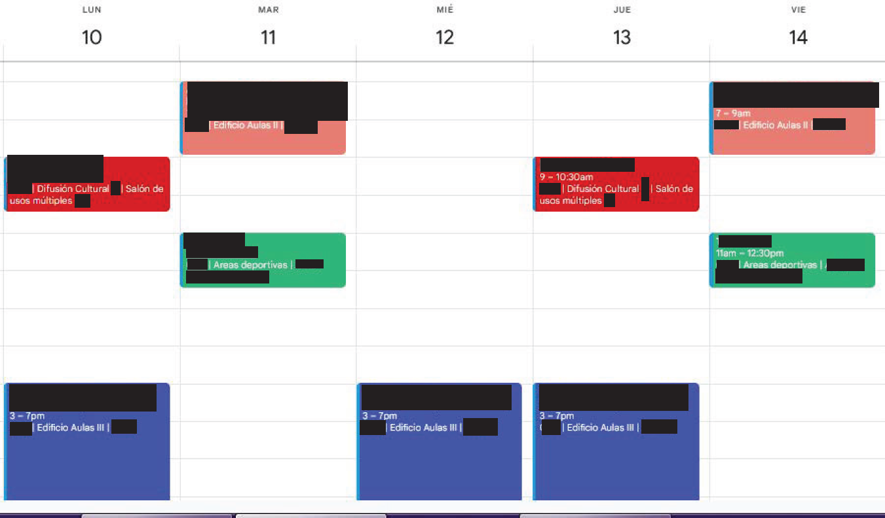
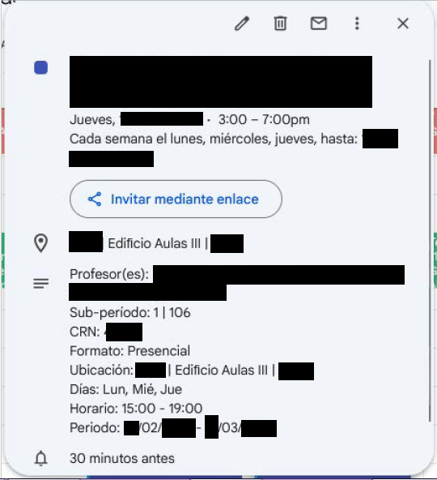

# Generador de Horarios del ITESM en Formato ICS / ITESM ICS Format Schedule Generator


**Este script de Python interpreta el PDF** generado al terminar la inscripción **de** materias a través de la plataforma de inscripciones **IRIS** del Instituto Tecnológico y de Estudios Superiores de Monterrey, **con el objetivo de generar archivos** (*.ics*) **para importar fácilmente tus clases (semanas TEC, clases LiFE, Semanas de Etapa de Evaluación, Optativas, etc.) a** tu aplicación de calendario favorita (**Google Calendar, Outlook Calendar, iCal** *(sólo a tráves de Safari)*) **para facilitar la organización y planificación de tus clases**.

**This Python script parses the PDF generated after completing course enrollment through the** Instituto Tecnológico y de Estudios Superiores de Monterrey **IRIS class registration platform to generate** (*.ics*) **files for easily importing your classes** (TEC Weeks, LiFE classes, Evaluation Stage Weeks, General Education Classes, etc.) **into** your preferred calendar app (**Google Calendar, Outlook Calendar, iCal** *(only via Safari)*) **to stramline organizing and planning your class schedule**.

---

## Descripción / Description



### Español

El programa extrae información relevante del PDF de tu horario, como:

- **Nombre de las materias**
- **Nombre de los profesores**
- **Duración de las materias**
- **Fechas de duración de la clase** *(un período o más, saltando períodos vacacionales, días festivos y semanas TEC, sí la clase no es una semana TEC)*
- **Ubicaciones** *(Salones, Áreas, Remoto, etc.)*

Con esta información, crea eventos en formato iCalendar (.ics) que puedes importar en aplicaciones de calendario como Google Calendar, Outlook o el calendario de tu dispositivo móvil.


<br>


### English

The program extracts relevant information from your schedule PDF, such as:

- **Courses names**
- **Professors names**
- **Classes length**
- **Class duration dates** *(a period or more, skipping vacational periods, holiday and TEC weeks, if the class is not a TEC Week)*
- **Locations** *(Classrooms, Areas, Remote/Online, etc.)*

Using this information, it creates events in iCalendar (.ics) format that you can import into calendar applications like Google Calendar, Outlook, or your mobile device's calendar.

---

## Características / Features

### Español

- **Conversión de todas las Materias en el PDF de tú horario**: **Con sólo ingresar el nombre del archivo *.pdf* generado por IRIS en Descargas, la fecha de consulta** *(actual por si quieres generar los archivos de las clases que te faltan, o igual o anterior a la fecha de inicio de semestre para generar los archivos de todas)* **y la fecha de inicio de semestre**, se muestran en consola todas las clases detectadas y **se generan automáticamente los archivos para importalos a tu app de calendario preferida**
<br>
- **Exclusión de semanas o días "especiales"**: Omite automáticamente las clases *no especiales* durante las semanas o días "especiales" (por ejemplo, semanas TEC, semanas 18, Semana Santa o días de asueto).

### English

- **Conversion of all courses in your PDF Schedule**: **By simply entering the filename of the *.pdf* generated by IRIS in Downloads, the query date** *(current date if you want to generate files for remaining classes, or equal to/prior to semester start date for all)***, and the semester start date**, all detected classes are displayed in the console and automatically generate importable files for your preferred calendar app.
<br>
- **Exclusion of "Special" Weeks/Days**: Automatically skips non-special classes during "special" periods (e.g., Tec Weeks, Week 18, Holy Week or Holidays). 

---

## Requisitos / Requirements

### Español

- **Python 3.6** *o una versión más reciente*
- **Bibliotecas Python**:
  - fitz
  - pytz
  - icalendar

### English

- **Python 3.6** *or newer*
- **Python Libraries**:
  - fitz
  - pytz
  - icalendar

---

## Uso / Usage

### Español

**Descarga e Instala Python en tu computadora** sí no lo tienes, puedes descargarlo [aquí](https://www.python.org/downloads/)

**Descarga el Archivo (*.zip*)**

**Descomprime y abre la carpeta con VSCode**

**Instala las extensiones de Python en VSCode** sí no las tienes.

**Abre una Terminal de Python e introduce el siguiente comando para instalar las dependencias necesarias para el programa:**

```bash
pip install PyMuPDF pytz icalendar
```

**Sí las dependencias no sé instalan correctamente prueba cambiando tu Python Interpreter**

**Coloca el PDF de tu horario en la carpeta `Descargas` de tu usuario**, si no está ahí por defecto tras descargarlo a tráves de IRIS en tu navegador, si aún no lo has descargado, [descárgalo aquí](https://iris.tec.mx/app/enroll/schedule/saved).

**Ejecuta el script introduciendo el siguiente comando en Terminal**:

```bash
python horarios.py
```

**Sigue las instrucciones en pantalla**:

- Ingresa el nombre del archivo PDF sin la extensión `.pdf`(de manera predeterminada el `.pdf` de tu horario se llama `Resumen_proceso`, a excepción de que lo hayas descargado más de una vez o en más de una ocasión).
- Proporciona la fecha actual (o la que tú quieras, antes o durante de cualquier fecha del semestre) y la fecha de inicio del semestre en el formato solicitado (`YYYY-MM-DD` Año - Mes - Día).

**Importa los archivos .ics generados**:

- Los archivos se guardarán en la carpeta `Horarios` (Sí no existe se creará) dentro de `Descargas`.
- Importa estos archivos en tu aplicación de calendario preferida.

### English

**Download and Install Python** on your computer if you don't have it. Get it [here](https://www.python.org/downloads/).  

**Download the Repository (*.zip*)**  

**Unzip and open the folder in VSCode**  

**Install Python extensions in VSCode** if you don't have them.  

**Open a Python Terminal and run this command to install required dependencies:**  
```bash
pip install PyMuPDF pytz icalendar
```

**If dependencies fail to install**, try switching your Python interpreter.  

**Place your schedule PDF in your user's `Downloads` folder**. If not already there after downloading via IRIS, [get it here](https://iris.tec.mx/app/enroll/schedule/saved).  

**Run the script with this terminal command**:  
```bash
python horarios.py
```

**Follow on-screen instructions**:  
- Enter PDF filename **without** `.pdf` extension (*default*: `Resumen_proceso` unless re-downloaded)  
- Provide current date (or any date before/during semester dates) and semester start date in `YYYY-MM-DD` format  

**Import generated .ics files**:  
- Files save to `Horarios` folder (auto-created if missing) within `Downloads`  
- Import these into your preferred calendar app. 

---

## Estructura del Proyecto / Project Structure

```
.
├── .gitignore
├── horarios.py
├── README.md
├── LICENSE
├── SECURITY.md
```

- **horarios.py**: Script principal para generar los archivos `.ics`. | Main script to generate the `.ics`. files.
- **README.md**: Este archivo. | This file.
- **LICENSE**: License de uso MIT | MIT's Use License
- **SECURITY.md**: Poliza de Seguridad | Security Policy

---

## Contribuciones / Contributions

### Español

¡Las contribuciones son bienvenidas! Por favor, abre un issue o un pull request para cualquier mejora o corrección.

### English

Contributions are welcome! Please open an issue or a pull request for any improvements or fixes.

---

## Licencia / License

### Español

Este proyecto está licenciado bajo la Licencia MIT. Consulta el archivo [LICENSE](LICENSE) para más detalles.

### English

This project is licensed under the MIT License. See the [LICENSE](LICENSE) file for more details.

---

Si tienes alguna otra pregunta o necesitas más ayuda, ¡no dudes en decírmelo!
---
Any doubts? I'm open to hear from you!
---
